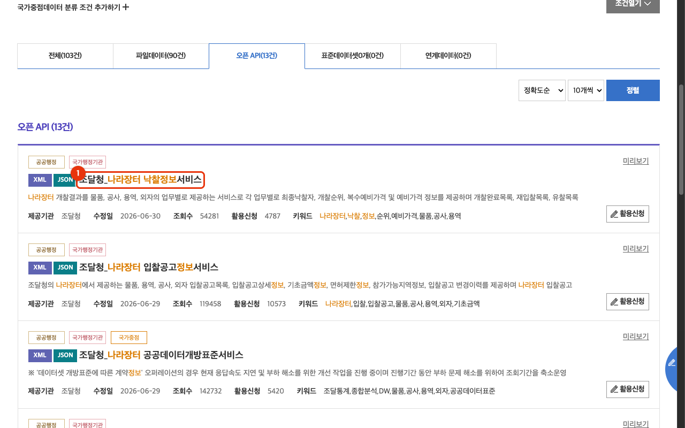
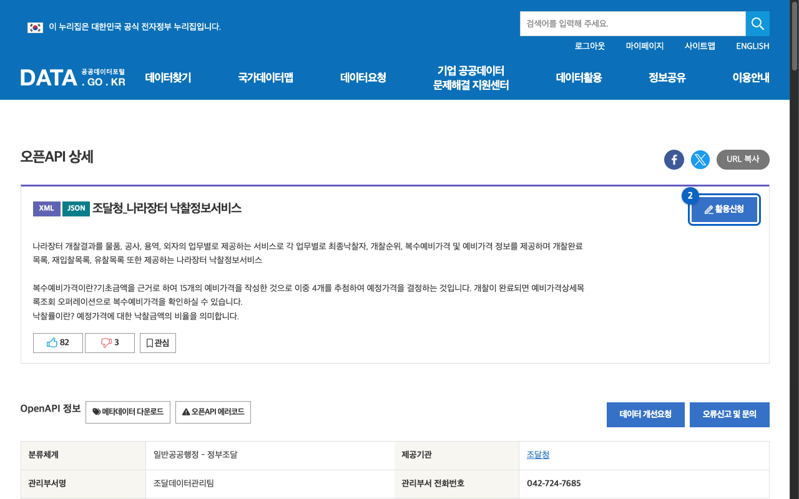
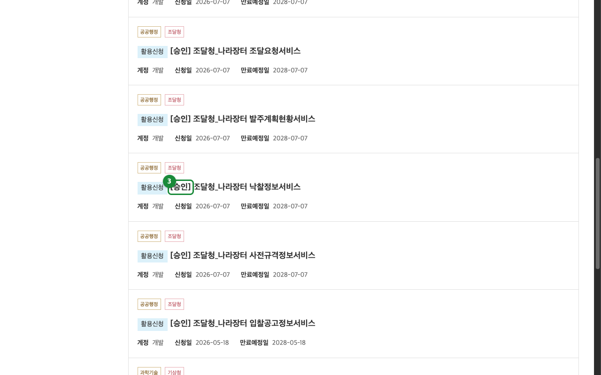
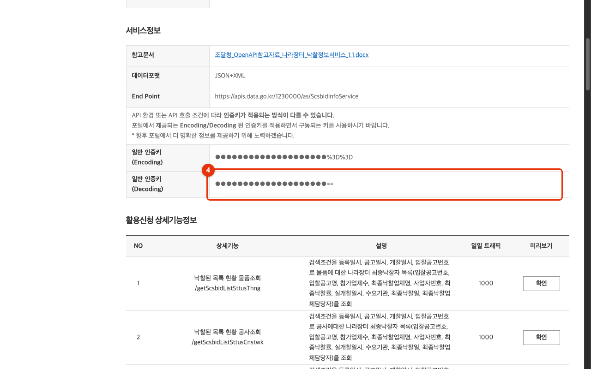

<!-- mcp-name: io.github.opendata-kr/narajangteo-opening -->

# data.go.kr 인증키 발급 가이드 (나라장터 낙찰정보서비스)

`narajangteo-opening-mcp`를 쓰려면 공공데이터포털(data.go.kr)에서 **나라장터 낙찰정보서비스**를 활용신청하고 **Decoding(원본) 인증키**를 발급받아야 한다. 공공데이터포털에 로그인한 상태에서 아래 4단계를 따른다. 이미지가 안 보여도 텍스트만으로 따라갈 수 있게 썼다.

> [!IMPORTANT]
> 인증키는 계정당 하나지만, **각 API는 저마다 활용신청 승인이 있어야 그 API에서 인증된다**. 다른 data.go.kr API에 쓰던 키가 있어도 나라장터 낙찰정보서비스를 따로 활용신청해 승인받지 않으면 이 서버는 인증 오류(결과코드 30)로 실패한다. 형제 서비스(입찰공고·사전규격 등)를 신청했더라도 낙찰정보서비스는 별개다.

## 1. 서비스 찾기

[공공데이터포털](https://www.data.go.kr)에서 "나라장터 낙찰정보"로 검색하고 **오픈 API** 탭에서 **조달청\_나라장터 낙찰정보서비스**를 연다(서비스 ID `ScsbidInfoService`).

## 2. 활용신청

서비스 상세 페이지에서 우측 상단 **활용신청** 버튼을 누른다.

신청 폼에서 아래를 채운다.

- **활용목적**: 개발이나 학습 등 목적을 적는다(예: "MCP 서버로 낙찰정보 조회").
- **첨부파일**: 없어도 된다.
- **상세기능**: 제공 오퍼레이션이 기본 선택돼 있다. 그대로 둔다.
- **라이선스 표시 동의**: 체크한다.

제출하면 이 서비스는 자동승인이라 대개 즉시 승인된다.

## 3. 승인 확인

**마이페이지 → 활용신청 현황**에서 나라장터 낙찰정보서비스 항목의 **[승인]** 상태를 확인한다.

## 4. Decoding 인증키 복사

승인된 항목을 눌러 **개발계정 상세보기**로 간다. **일반 인증키 (Decoding)** 값을 복사한다.

> [!WARNING]
> 반드시 **Decoding**(원본, 끝이 `==`) 키를 쓴다. **Encoding**(끝이 `%3D%3D`) 키를 넣으면 서버가 한 번 더 인코딩해 이중 인코딩으로 인증 오류(결과코드 30)가 난다. 이 서버는 사전 인코딩된 키로 보이면 시작 시 경고한다.

복사한 키를 MCP 클라이언트 설정의 `DATA_GO_KR_SERVICE_KEY`에 넣는다([README의 MCP 클라이언트 설정](../README.md#mcp-클라이언트-설정) 참조).

## 잘 안 될 때

- **결과코드 30**: 이 API를 활용신청하지 않았거나, 승인 전이거나, Encoding 키를 넣었을 때 난다. 위 2~4단계를 다시 확인한다.
- 승인 직후 몇 분간 키가 활성화되지 않을 수 있다. 잠시 후 재시도한다.
- 인증키는 계정당 하나이며, 같은 계정으로 활용신청한 다른 data.go.kr API에도 같은 키를 재사용한다.
